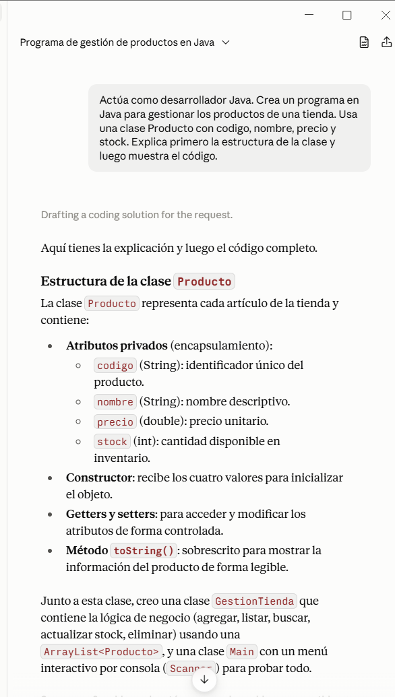
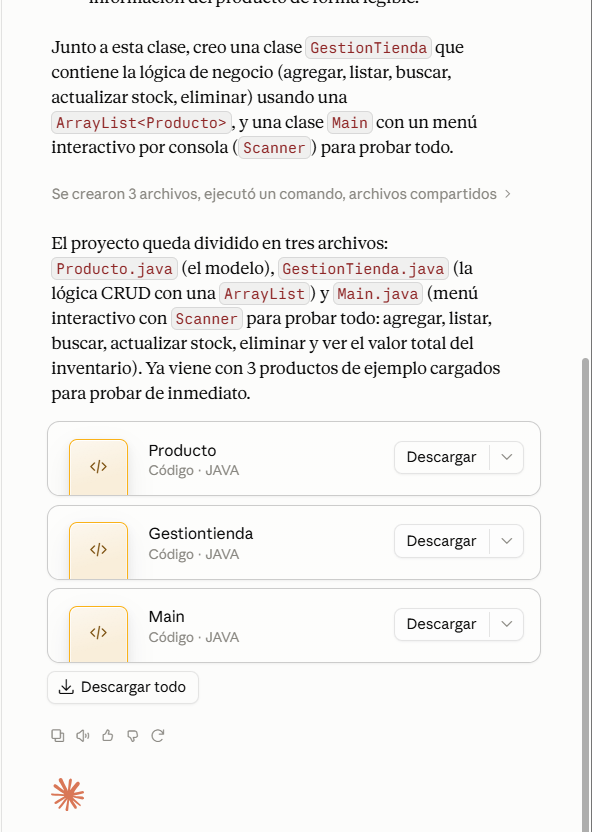
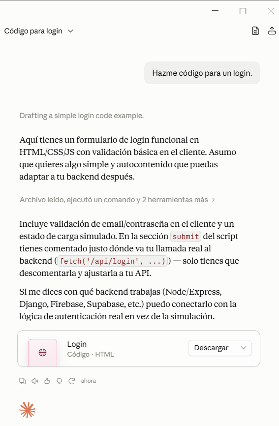
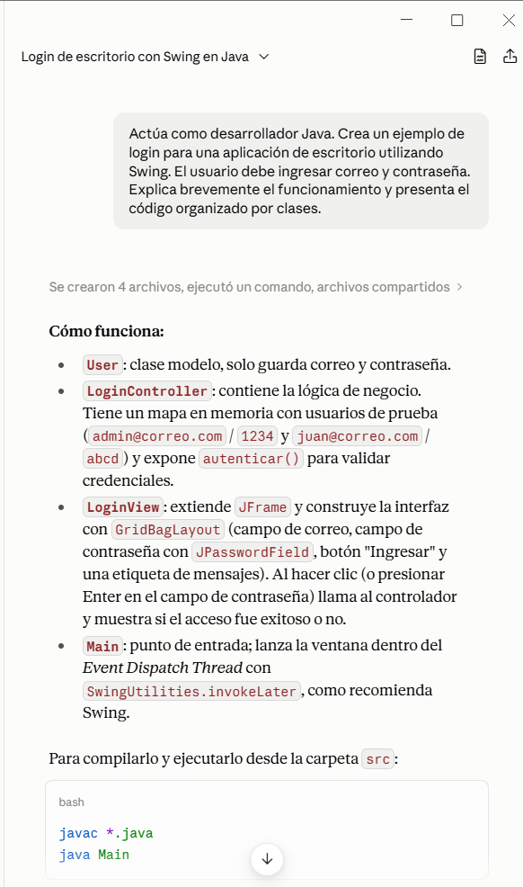
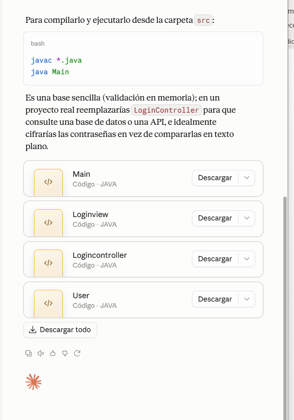
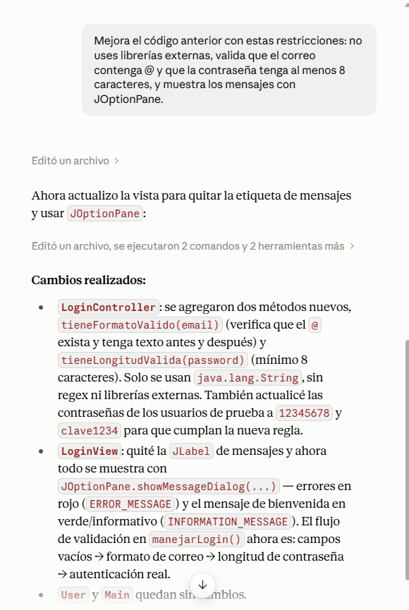
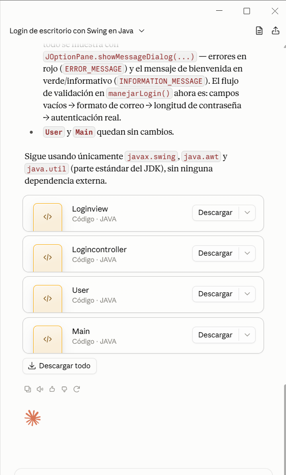

# Bitácora de Prompts

Laboratorio 06: Fundamentos de Ingeniería de Prompts.

Herramienta de IA usada: Claude 

## Ejercicio 2: Tokens y ventana de contexto

### Conteo de tokens

| Texto | Caracteres | Tokens |
|---|---|---|
| Los estudiantes programan en Java. | 34 | 7 |
| The students program in Java. | 29 | 6 |
| desafortunadamente | 19 | 5 |

### Prueba de ventana de contexto

**Mismo chat:**
- Mensaje: *"Estoy desarrollando una aplicación llamada TiendaTec en Java Swing. Solo responde: Entendido."*
- Pregunta: *"¿Cómo se llama mi aplicación y qué tecnología usa?"*
- Respuesta: TiendaTec, Java Swing 

**Chat nuevo:**
- Solo la pregunta → en mi caso, la IA sí respondió correctamente 

### Observaciones
- Normalmente, en un chat nuevo la IA no debería recordar. Pero algunas herramientas tienen una función de memoria activada que guarda datos entre conversaciones.
- Por eso es importante **verificar** el comportamiento real: si la IA responde en un chat nuevo, no es porque "recuerde", sino porque la plataforma comparte información entre sesiones.
- Cada herramienta puede comportarse de manera distinta.

## Ejercicio 3: Temperatura

| Temperatura | % de BiblioTec | Nombres en los 5 intentos |
|---|---|---|
| 0 | 100% | BiblioTec, BiblioTec, BiblioTec, BiblioTec, BiblioTec |
| 0.5 | 65.3% | BiblioTec, BiblioTec, BiblioTec, PaginaLibre, BiblioTec |
| 1 | 44.5% | LibroYa, BiblioTec, BiblioTec, BiblioTec, BiblioTec |
| 1.8 | 32.2% | LibroYa, NubeDeTinta, LibroYa, PrestaLibro, BiblioTec |

## Ejercicio 4: Prompt vago vs estructurado

| Criterio | Prompt vago | Prompt estructurado |
|---|---|---|
| Menciona el objetivo del sistema | No | Sí |
| Menciona a los usuarios principales | No | Sí |
| Tiene exactamente 3 funcionalidades | No | Sí |
| Está en 3 párrafos | No | Sí |
| Lo usaría en un informe real | No | Sí |

### Prompt vago
> Hazme un resumen.

**Respuesta obtenida:**
¡Con gusto! Pero necesito saber de qué quieres el resumen. Por ejemplo:
- ¿Un documento o archivo que quieras subir?
- ¿Un tema específico que te interese?
- ¿Un artículo o página web (puedes darme el enlace)?
- ¿Algo que ya conversamos antes?

Cuéntame un poco más y lo preparo enseguida.

### Prompt estructurado
> Haz un resumen del tema "tokens y ventana de contexto".
> - Máximo: 3 frases
> - Tono: sencillo, para compañeros de clase
> - Estructura: primero qué son los tokens, luego qué es la ventana de contexto

**Respuesta obtenida:**
Los tokens son los pedacitos en que un modelo de IA divide el texto para poder leerlo y procesarlo. La ventana de contexto es la cantidad máxima de tokens que el modelo puede "tener en mente" al mismo tiempo. Si una conversación supera ese límite, el modelo empieza a "olvidar" las partes más antiguas.

### Diferencia
El prompt vago no da resultado porque falta información: la IA no sabe qué resumir. El estructurado obtiene respuesta clara, ordenada y justo como se pidió.

## Ejercicio 5: Anatomía de un prompt

### 1. Niveles del prompt
| Nivel | Prompt | Qué cambió |
|---|---|---|
| 1 | Crea un programa en Java. | — |
| 2 + Rol | Actúa como desarrollador Java. Crea un programa en Java. | Se define quién responde |
| 3 + Contexto | ...para gestionar los productos de una tienda. | Se indica para qué sirve |
| 4 + Instrucción | ...usando una clase Producto con codigo, nombre, precio y stock. | Se detalla qué incluir |
| 5 + Formato | ...Explica primero la estructura y luego muestra el código. | Se define el orden |

### 2. Componentes del prompt
| Componente | Texto |
|---|---|
| Rol | Actúa como desarrollador Java |
| Contexto | Para gestionar productos de una tienda |
| Instrucción | Clase Producto con codigo, nombre, precio y stock |
| Formato | Primero explicación, luego código |

### 3. Resultado obtenido

## Ejercicio 6: Del prompt básico al profesional

### Versión básica
> Hazme código para un login.

**Respuesta obtenida:**

### Versión profesional
> Actúa como desarrollador Java. Crea un ejemplo de login para una aplicación de escritorio utilizando Swing. El usuario debe ingresar correo y contraseña. Explica brevemente el funcionamiento y presenta el código organizado por clases.

**Respuesta obtenida:**

### Iteración — Mejora del resultado
> Mejora el código anterior con estas restricciones: no uses librerías externas, valida que el correo contenga @ y que la contraseña tenga al menos 8 caracteres, y muestra los mensajes con JOptionPane.

**Respuesta obtenida:**

### Evaluación del resultado
| Qué revisar | Cumple (Sí / No) |
|---|---|
| ¿Pide correo y contraseña? | Sí |
| ¿Explica el funcionamiento antes o después del código? | Sí |
| ¿El código está organizado en clases? | Sí |
| ¿Valida los datos que ingresa el usuario? | Sí |

- [Bitácora de prompts](prompts/BITACORA.md)